# Design Document: Bundle Optimization

## Overview

This design document outlines the technical approach for optimizing the FoldedHearts application bundle size and performance. Based on Lighthouse audit findings showing ~139 KiB of unused JavaScript and 58ms main-thread blocking tasks, we will implement route-based code splitting, lazy loading of heavy 3D visualization libraries, vendor chunk optimization, and build analysis tooling.

The optimization strategy prioritizes the "instant gratification" experience core to FoldedHearts—users should see the landing page immediately, with 3D visualization code loading only when needed.

## Architecture

### Current State

```
┌─────────────────────────────────────────────────────────────┐
│                    main-XBUcmHDj.js (313.5 KiB)             │
│  ┌─────────────┐ ┌─────────────┐ ┌─────────────────────────┐│
│  │   React     │ │  TanStack   │ │      3Dmol.js           ││
│  │  React-DOM  │ │   Router    │ │      (~300 KiB)         ││
│  └─────────────┘ └─────────────┘ └─────────────────────────┘│
│  ┌─────────────┐ ┌─────────────┐ ┌─────────────────────────┐│
│  │   Three.js  │ │   Motion    │ │   All Route Components  ││
│  │  (~150 KiB) │ │  (~50 KiB)  │ │                         ││
│  └─────────────┘ └─────────────┘ └─────────────────────────┘│
└─────────────────────────────────────────────────────────────┘
```

### Target State

```
┌──────────────────────────────────────────────────────────────────────────┐
│  Initial Load (Critical Path)                                            │
│  ┌────────────────┐  ┌────────────────┐  ┌────────────────────────────┐  │
│  │ vendor-react   │  │ vendor-router  │  │  index-route (homepage)    │  │
│  │ (~45 KiB gz)   │  │ (~25 KiB gz)   │  │  (~15 KiB gz)              │  │
│  └────────────────┘  └────────────────┘  └────────────────────────────┘  │
└──────────────────────────────────────────────────────────────────────────┘

┌──────────────────────────────────────────────────────────────────────────┐
│  Lazy Loaded Chunks (On Demand)                                          │
│  ┌────────────────┐  ┌────────────────┐  ┌────────────────────────────┐  │
│  │ 3dmol-chunk    │  │ three-chunk    │  │  fold-route                │  │
│  │ (~100 KiB gz)  │  │ (~50 KiB gz)   │  │  + ProteinViewer           │  │
│  └────────────────┘  └────────────────┘  └────────────────────────────┘  │
│  ┌────────────────┐  ┌────────────────┐  ┌────────────────────────────┐  │
│  │ create-route   │  │ about-route    │  │  vendor-motion             │  │
│  │ (~8 KiB gz)    │  │ (~3 KiB gz)    │  │  (~20 KiB gz)              │  │
│  └────────────────┘  └────────────────┘  └────────────────────────────┘  │
└──────────────────────────────────────────────────────────────────────────┘
```

### Loading Flow

```mermaid
sequenceDiagram
    participant User
    participant Browser
    participant Server
    participant CDN

    User->>Browser: Visit homepage (/)
    Browser->>CDN: Request index.html
    CDN-->>Browser: HTML with preload hints
    
    par Critical Resources
        Browser->>CDN: vendor-react.js
        Browser->>CDN: vendor-router.js
        Browser->>CDN: index-route.js
    end
    
    Browser->>Browser: Render homepage (FCP)
    
    Note over Browser: Three.js loads async for DNAHeart
    Browser->>CDN: three-chunk.js (low priority)
    
    User->>Browser: Navigate to /create
    Browser->>CDN: create-route.js
    
    Note over Browser: Prefetch fold route in background
    Browser->>CDN: fold-route.js (prefetch)
    
    User->>Browser: Submit names → /fold/$names
    Browser->>Browser: Route already cached
    
    Note over Browser: 3Dmol loads when ProteinViewer mounts
    Browser->>CDN: 3dmol-chunk.js
    Browser->>Browser: Render protein (LCP)
```



## Components and Interfaces

### 1. Vite Build Configuration

The core of the optimization lives in `vite.config.ts` with manual chunk configuration:

```typescript
// vite.config.ts
import { defineConfig } from 'vite'
import { visualizer } from 'rollup-plugin-visualizer'

export default defineConfig({
  build: {
    rollupOptions: {
      output: {
        manualChunks: (id: string) => {
          // React core - loaded on every page
          if (id.includes('node_modules/react/') || 
              id.includes('node_modules/react-dom/')) {
            return 'vendor-react'
          }
          
          // TanStack Router/Query - loaded on every page
          if (id.includes('node_modules/@tanstack/')) {
            return 'vendor-tanstack'
          }
          
          // 3Dmol - only needed on fold page
          if (id.includes('node_modules/3dmol/')) {
            return 'lib-3dmol'
          }
          
          // Three.js - only needed for DNAHeart on homepage
          if (id.includes('node_modules/three/')) {
            return 'lib-three'
          }
          
          // Motion/Framer - used across multiple pages
          if (id.includes('node_modules/motion/') ||
              id.includes('node_modules/framer-motion/')) {
            return 'vendor-motion'
          }
          
          // Radix UI components
          if (id.includes('node_modules/radix-ui/') ||
              id.includes('node_modules/@radix-ui/')) {
            return 'vendor-radix'
          }
        }
      }
    }
  },
  plugins: [
    // Bundle analysis (only in build)
    visualizer({
      filename: 'dist/stats.html',
      open: false,
      gzipSize: true,
      brotliSize: true
    })
  ]
})
```

### 2. Route Code Splitting with TanStack Router

TanStack Router supports automatic code splitting via the `.lazy.tsx` suffix pattern. We'll split heavy routes:

```typescript
// src/routes/fold.$names.tsx (critical route config only)
import { createFileRoute } from '@tanstack/react-router'

export const Route = createFileRoute('/fold/$names')({
  // Head meta stays in main file for SSR
  head: ({ params }) => ({
    meta: [/* ... */]
  }),
  // Loader stays for data prefetching
  loader: async ({ context, params }) => {
    // Lightweight loader - no heavy imports
  }
})

// src/routes/fold.$names.lazy.tsx (lazy-loaded component)
import { createLazyFileRoute } from '@tanstack/react-router'

export const Route = createLazyFileRoute('/fold/$names')({
  component: FoldRoute,
  pendingComponent: FoldLoadingSkeleton,
  errorComponent: FoldErrorBoundary
})

function FoldRoute() {
  // Heavy component with ProteinViewer
}
```

### 3. Dynamic Import Wrapper for 3Dmol.js

```typescript
// src/components/ProteinViewer.tsx
import { useEffect, useRef, useState } from 'react'
import type { GLViewer } from '3dmol'

interface ProteinViewerProps {
  pdbData: string | undefined
  isLoading?: boolean
  // ... other props
}

export function ProteinViewer({ pdbData, isLoading, ...props }: ProteinViewerProps) {
  const containerRef = useRef<HTMLDivElement>(null)
  const viewerRef = useRef<GLViewer | null>(null)
  const [lib3Dmol, setLib3Dmol] = useState<typeof import('3dmol') | null>(null)
  const [loadError, setLoadError] = useState<string | null>(null)

  // Lazy load 3Dmol.js only when component mounts
  useEffect(() => {
    let cancelled = false
    
    import('3dmol')
      .then((module) => {
        if (!cancelled) {
          setLib3Dmol(module)
        }
      })
      .catch((err) => {
        if (!cancelled) {
          setLoadError('Failed to load 3D viewer. Please refresh the page.')
          console.error('3Dmol load error:', err)
        }
      })
    
    return () => {
      cancelled = true
    }
  }, [])

  // Initialize viewer once library is loaded
  useEffect(() => {
    if (!lib3Dmol || !containerRef.current || !pdbData) return
    
    const viewer = lib3Dmol.createViewer(containerRef.current, {
      backgroundColor: '#141414'
    })
    
    viewer.addModel(pdbData, 'pdb')
    // ... rest of viewer setup
    
    viewerRef.current = viewer
    
    return () => {
      viewer.clear()
    }
  }, [lib3Dmol, pdbData])

  if (loadError) {
    return <ErrorDisplay message={loadError} onRetry={() => window.location.reload()} />
  }

  if (!lib3Dmol || isLoading) {
    return <LoadingSkeleton />
  }

  return (
    <div ref={containerRef} className="protein-viewer-canvas" />
  )
}
```

### 4. Dynamic Import Wrapper for Three.js (DNAHeart)

```typescript
// src/components/landing/DNAHeart.tsx
import { useEffect, useRef, useState } from 'react'

export function DNAHeart({ className }: { className?: string }) {
  const containerRef = useRef<HTMLDivElement>(null)
  const [isLoaded, setIsLoaded] = useState(false)
  const [loadError, setLoadError] = useState(false)

  useEffect(() => {
    if (!containerRef.current) return
    
    let cleanup: (() => void) | undefined

    // Dynamic import of Three.js
    import('three')
      .then((THREE) => {
        if (!containerRef.current) return
        
        // Initialize Three.js scene
        const scene = new THREE.Scene()
        const camera = new THREE.PerspectiveCamera(75, /* ... */)
        const renderer = new THREE.WebGLRenderer({ antialias: true, alpha: true })
        
        // ... rest of initialization
        
        setIsLoaded(true)
        
        cleanup = () => {
          renderer.dispose()
          // ... cleanup
        }
      })
      .catch((err) => {
        console.error('Three.js load error:', err)
        setLoadError(true)
      })

    return () => cleanup?.()
  }, [])

  // Show placeholder while loading
  if (!isLoaded && !loadError) {
    return (
      <div className={className}>
        <DNAHeartPlaceholder />
      </div>
    )
  }

  // Graceful fallback on error
  if (loadError) {
    return (
      <div className={className}>
        <DNAHeartStaticFallback />
      </div>
    )
  }

  return (
    <div ref={containerRef} className={className} />
  )
}

// Static SVG fallback for when Three.js fails to load
function DNAHeartStaticFallback() {
  return (
    <svg viewBox="0 0 200 200" className="w-full h-full">
      {/* Simplified DNA heart SVG */}
    </svg>
  )
}
```

### 5. Route Prefetching Configuration

```typescript
// src/router.tsx
import { createRouter } from '@tanstack/react-router'

export const getRouter = () => {
  const router = createRouter({
    routeTree,
    defaultPreload: 'intent', // Prefetch on hover/focus
    defaultPreloadStaleTime: 0,
    // ... other config
  })
  
  return router
}
```

### 6. Build Analysis Plugin Configuration

```typescript
// vite.config.ts
import { visualizer } from 'rollup-plugin-visualizer'

export default defineConfig({
  plugins: [
    // Only include in production builds
    process.env.ANALYZE && visualizer({
      filename: 'dist/bundle-stats.html',
      open: true,
      gzipSize: true,
      brotliSize: true,
      template: 'treemap' // or 'sunburst', 'network'
    })
  ].filter(Boolean)
})
```

## Data Models

### Chunk Configuration Type

```typescript
interface ChunkConfig {
  name: string
  test: (id: string) => boolean
  priority: number
  reuseExistingChunk: boolean
}

interface BundleStats {
  chunkName: string
  rawSize: number
  gzipSize: number
  brotliSize: number
  modules: string[]
}
```

### Loading State Types

```typescript
type LibraryLoadState = 
  | { status: 'idle' }
  | { status: 'loading' }
  | { status: 'loaded'; module: unknown }
  | { status: 'error'; error: Error }

interface LazyComponentProps<T> {
  loader: () => Promise<T>
  fallback: React.ReactNode
  errorFallback: React.ReactNode
}
```

## Correctness Properties

*A property is a characteristic or behavior that should hold true across all valid executions of a system—essentially, a formal statement about what the system should do. Properties serve as the bridge between human-readable specifications and machine-verifiable correctness guarantees.*


Based on the prework analysis, I've identified the following testable properties. After reflection, I've consolidated redundant properties into comprehensive tests.

### Property 1: Initial Bundle Excludes Heavy 3D Libraries

*For any* production build, the initial/entry JavaScript chunks loaded on the homepage SHALL NOT contain code from the 3Dmol.js library or the ProteinViewer component, ensuring users don't download protein visualization code until they navigate to the fold page.

**Validates: Requirements 1.1, 1.5, 5.3**

### Property 2: Chunk Separation Structure

*For any* production build, the Bundle_Optimizer SHALL produce distinct chunks such that:
- Each route (index, create, fold, about) has its own chunk
- 3Dmol.js is in a separate chunk from the main bundle
- Three.js is in a separate chunk from the main bundle
- React/React-DOM are in a dedicated vendor chunk
- TanStack packages are in a dedicated vendor chunk
- Motion library is in a dedicated vendor chunk

**Validates: Requirements 1.4, 2.6, 2.7, 3.1, 3.2, 3.3**

### Property 3: Bundle Size Limits

*For any* production build, the gzipped size of the main entry chunk SHALL be under 100 KiB, and the sum of all critical-path chunks (required for First Contentful Paint on homepage) SHALL be under 50 KiB gzipped.

**Validates: Requirements 5.1, 5.2**

### Property 4: Content Hash Naming for Cacheability

*For any* production build, all generated chunk filenames SHALL include a content hash, ensuring that unchanged chunks maintain the same filename across builds for long-term browser caching.

**Validates: Requirements 3.5**

## Error Handling

### Dynamic Import Failures

When a dynamic import fails (network error, timeout, etc.), components must handle gracefully:

```typescript
// Error boundary pattern for lazy-loaded components
function LazyComponentWrapper<T>({
  loader,
  fallback,
  errorFallback,
  onRetry
}: {
  loader: () => Promise<{ default: React.ComponentType<T> }>
  fallback: React.ReactNode
  errorFallback: (retry: () => void) => React.ReactNode
  onRetry?: () => void
}) {
  const [Component, setComponent] = useState<React.ComponentType<T> | null>(null)
  const [error, setError] = useState<Error | null>(null)
  const [retryCount, setRetryCount] = useState(0)

  useEffect(() => {
    let cancelled = false
    
    loader()
      .then((mod) => {
        if (!cancelled) setComponent(() => mod.default)
      })
      .catch((err) => {
        if (!cancelled) setError(err)
      })
    
    return () => { cancelled = true }
  }, [loader, retryCount])

  const handleRetry = () => {
    setError(null)
    setRetryCount((c) => c + 1)
    onRetry?.()
  }

  if (error) return errorFallback(handleRetry)
  if (!Component) return fallback
  return <Component {...props} />
}
```

### ProteinViewer Error States

| Error Type | User Message | Recovery Action |
|------------|--------------|-----------------|
| 3Dmol load failure | "Unable to load 3D viewer. Please refresh the page." | Retry button |
| WebGL not supported | "Your browser doesn't support 3D graphics. Try Chrome or Firefox." | Link to supported browsers |
| PDB parse error | "Something went wrong rendering your protein. Try again?" | Retry with same data |

### DNAHeart Fallback

When Three.js fails to load, display a static SVG version of the DNA heart animation to maintain visual appeal:

```typescript
function DNAHeartStaticFallback() {
  return (
    <svg viewBox="0 0 200 200" className="w-full h-full animate-pulse">
      <path 
        d="M100 180 C40 140 10 100 10 60 C10 30 35 10 65 10 C80 10 95 20 100 35 
           C105 20 120 10 135 10 C165 10 190 30 190 60 C190 100 160 140 100 180"
        fill="none"
        stroke="url(#heartGradient)"
        strokeWidth="3"
      />
      <defs>
        <linearGradient id="heartGradient">
          <stop offset="0%" stopColor="#f472b6" />
          <stop offset="100%" stopColor="#a855f7" />
        </linearGradient>
      </defs>
    </svg>
  )
}
```

## Testing Strategy

### Unit Tests

Unit tests focus on specific component behaviors and edge cases:

1. **ProteinViewer loading states**: Test that loading skeleton appears before 3Dmol loads
2. **ProteinViewer error handling**: Test error UI when dynamic import fails
3. **DNAHeart fallback**: Test static fallback renders when Three.js unavailable
4. **Route prefetching**: Test that hover triggers prefetch calls

### Property-Based Tests

Property tests validate universal properties across all builds using a property-based testing library (e.g., fast-check for TypeScript):

**Test Configuration:**
- Minimum 100 iterations per property test
- Tag format: **Feature: bundle-optimization, Property {number}: {property_text}**

**Property Test 1: Initial Bundle Exclusion**
```typescript
// Feature: bundle-optimization, Property 1: Initial Bundle Excludes Heavy 3D Libraries
describe('Bundle Optimization Properties', () => {
  it('should exclude 3Dmol from initial chunks', async () => {
    const buildManifest = await readBuildManifest()
    const entryChunks = getEntryChunks(buildManifest)
    
    for (const chunk of entryChunks) {
      const content = await readChunkContent(chunk)
      expect(content).not.toContain('3dmol')
      expect(content).not.toContain('GLViewer')
    }
  })
})
```

**Property Test 2: Chunk Separation**
```typescript
// Feature: bundle-optimization, Property 2: Chunk Separation Structure
it('should produce separate chunks for heavy dependencies', async () => {
  const chunks = await listBuildChunks()
  
  // Verify separate chunks exist
  expect(chunks.some(c => c.includes('3dmol') || c.includes('lib-3dmol'))).toBe(true)
  expect(chunks.some(c => c.includes('three') || c.includes('lib-three'))).toBe(true)
  expect(chunks.some(c => c.includes('vendor-react'))).toBe(true)
  expect(chunks.some(c => c.includes('vendor-tanstack'))).toBe(true)
  
  // Verify route chunks exist
  expect(chunks.some(c => c.includes('fold'))).toBe(true)
  expect(chunks.some(c => c.includes('create'))).toBe(true)
})
```

**Property Test 3: Bundle Size Limits**
```typescript
// Feature: bundle-optimization, Property 3: Bundle Size Limits
it('should keep entry chunk under 100 KiB gzipped', async () => {
  const entryChunk = await getEntryChunk()
  const gzipSize = await getGzipSize(entryChunk)
  
  expect(gzipSize).toBeLessThan(100 * 1024) // 100 KiB
})

it('should keep critical path under 50 KiB gzipped', async () => {
  const criticalChunks = await getCriticalPathChunks()
  const totalSize = await getTotalGzipSize(criticalChunks)
  
  expect(totalSize).toBeLessThan(50 * 1024) // 50 KiB
})
```

**Property Test 4: Content Hash Naming**
```typescript
// Feature: bundle-optimization, Property 4: Content Hash Naming
it('should include content hashes in chunk filenames', async () => {
  const chunks = await listBuildChunks()
  const hashPattern = /[a-f0-9]{8}/i // 8-char hex hash
  
  for (const chunk of chunks) {
    expect(chunk).toMatch(hashPattern)
  }
})
```

### Integration Tests

1. **Homepage load test**: Verify only expected chunks load on initial homepage visit
2. **Navigation test**: Verify route chunks load on navigation
3. **Prefetch test**: Verify prefetch requests fire on link hover

### Build Verification Script

```bash
#!/bin/bash
# scripts/verify-bundle.sh

echo "🔍 Analyzing bundle..."

# Build with analysis
ANALYZE=true npm run build

# Check entry chunk size
ENTRY_SIZE=$(stat -f%z dist/assets/index-*.js 2>/dev/null || stat -c%s dist/assets/index-*.js)
ENTRY_SIZE_KB=$((ENTRY_SIZE / 1024))

if [ $ENTRY_SIZE_KB -gt 100 ]; then
  echo "❌ Entry chunk too large: ${ENTRY_SIZE_KB}KB (limit: 100KB)"
  exit 1
fi

echo "✅ Entry chunk size: ${ENTRY_SIZE_KB}KB"

# Verify chunk separation
if ls dist/assets/*3dmol*.js 1>/dev/null 2>&1; then
  echo "✅ 3Dmol chunk separated"
else
  echo "❌ 3Dmol not in separate chunk"
  exit 1
fi

if ls dist/assets/*three*.js 1>/dev/null 2>&1; then
  echo "✅ Three.js chunk separated"
else
  echo "❌ Three.js not in separate chunk"
  exit 1
fi

echo "🎉 Bundle verification passed!"
```

## Implementation Notes

### TanStack Router Code Splitting

The project uses TanStack Router with file-based routing. To enable automatic code splitting:

1. Enable `autoCodeSplitting` in the router plugin config
2. Or manually split routes using `.lazy.tsx` suffix pattern

The `.lazy.tsx` approach gives more control and is recommended for this optimization:

```
src/routes/
├── __root.tsx           # Always loaded (shell)
├── index.tsx            # Homepage (critical)
├── index.lazy.tsx       # Homepage component (can be lazy if needed)
├── create.tsx           # Create page loader
├── create.lazy.tsx      # Create page component
├── fold.$names.tsx      # Fold page loader + head
├── fold.$names.lazy.tsx # Fold page component + ProteinViewer
└── about.tsx            # About page (small, can stay together)
```

### Vite Plugin Order

Plugin order matters in Vite. The visualizer plugin should be last:

```typescript
plugins: [
  devtools(),
  nitro(),
  viteTsConfigPaths({ projects: ['./tsconfig.json'] }),
  tailwindcss(),
  tanstackStart(),
  viteReact(),
  // Visualizer last - only in production builds
  process.env.ANALYZE && visualizer({ /* config */ })
].filter(Boolean)
```

### SSR Considerations

Since FoldedHearts uses TanStack Start with SSR:

1. Dynamic imports work on both server and client
2. The `head` function in routes must stay in the main file (not `.lazy.tsx`) for SSR meta tags
3. Loaders can stay in main file for data prefetching during SSR
4. Only the `component` moves to `.lazy.tsx`
