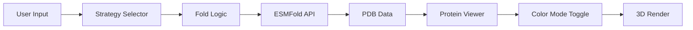

# Design Document

## Overview

This design enhances the FoldedHearts protein folding system to generate more visually unique and structurally diverse "Love Proteins." The current implementation produces similar-looking structures because it uses a single flexible linker (GGSGGS). This enhancement introduces three linker strategies and pLDDT-based confidence coloring to make each protein truly one-of-a-kind.

The three strategies are:

1. **Flexible Bond** (GGSGGS) - Original flexible linker for smooth, flowing structures
2. **Structural Anchor** (WPHWP) - Bulky motif that forces angular, interesting shapes
3. **True Love Bond** (Cysteine bridges) - Creates potential loop/circular structures

## Architecture

The enhancement modifies two main areas:

```
src/
├── utils/
│   └── foldLogic.ts          # MODIFIED - Add linker strategies
├── components/
│   └── ProteinViewer.tsx     # MODIFIED - Add pLDDT coloring
└── routes/
    └── fold.$names.tsx       # MODIFIED - Add strategy selector UI
```

### Data Flow



## Components and Interfaces

### LinkerStrategy Type

```typescript
type LinkerStrategy = 'flexible' | 'anchor' | 'cysteine'

interface LinkerConfig {
  strategy: LinkerStrategy
  motif: string
  displayName: string
  description: string
}

const LINKER_CONFIGS: Record<LinkerStrategy, LinkerConfig> = {
  flexible: {
    strategy: 'flexible',
    motif: 'GGSGGS',
    displayName: 'Flexible Bond',
    description: 'A smooth, flowing connection between your names',
  },
  anchor: {
    strategy: 'anchor',
    motif: 'WPHWP',
    displayName: 'Structural Anchor',
    description: 'A bulky hinge that creates angular, unique shapes',
  },
  cysteine: {
    strategy: 'cysteine',
    motif: 'GGSGGS',
    displayName: 'True Love Bond',
    description: 'Creates a molecular loop - the strongest bond in nature',
  },
}
```

### Updated createLoveSequence Function

```typescript
interface CreateLoveSequenceOptions {
  strategy?: LinkerStrategy
}

interface CreateLoveSequenceResult {
  sequence: string
  strategy: LinkerStrategy
  name1Sequence: string
  name2Sequence: string
  linkerMotif: string
}

function createLoveSequence(
  name1: string,
  name2: string,
  options?: CreateLoveSequenceOptions,
): CreateLoveSequenceResult
```

### ProteinViewer Color Mode

```typescript
type ColorMode = 'spectrum' | 'plddt'

interface ProteinViewerProps {
  pdbData: string | undefined
  isLoading?: boolean
  name1?: string
  name2?: string
  className?: string
  colorMode?: ColorMode // NEW
  onColorModeChange?: (mode: ColorMode) => void // NEW
}
```

### pLDDT Color Gradient

The romantic pLDDT color scheme:

- High confidence (pLDDT > 70): Bright pink (#ec4899)
- Medium confidence (50-70): Rose (#f43f5e)
- Low confidence (< 50): Deep purple (#7c3aed)

```typescript
const PLDDT_COLOR_SCHEME = {
  high: { min: 70, max: 100, color: '#ec4899' }, // Pink-500
  medium: { min: 50, max: 70, color: '#f43f5e' }, // Rose-500
  low: { min: 0, max: 50, color: '#7c3aed' }, // Violet-600
}
```

## Data Models

### Sequence Generation

For each strategy, the sequence structure is:

| Strategy | Structure                            |
| -------- | ------------------------------------ |
| flexible | `[Name1] + GGSGGS + [Name2]`         |
| anchor   | `[Name1] + WPHWP + [Name2]`          |
| cysteine | `C + [Name1] + GGSGGS + [Name2] + C` |

### Valid Amino Acid Alphabet

The 20 standard amino acids: `ACDEFGHIKLMNPQRSTVWY`

All output sequences must contain only these characters.

## Correctness Properties

_A property is a characteristic or behavior that should hold true across all valid executions of a system—essentially, a formal statement about what the system should do. Properties serve as the bridge between human-readable specifications and machine-verifiable correctness guarantees._

### Property 1: Linker Strategy Correctness

_For any_ valid name pair and linker strategy, the generated sequence SHALL contain the correct linker motif:

- "flexible" → contains "GGSGGS"
- "anchor" → contains "WPHWP"
- "cysteine" → contains "GGSGGS" (with C bookends)

**Validates: Requirements 1.1, 1.2, 1.3**

### Property 2: Cysteine Bridge Structure

_For any_ name pair using the "cysteine" strategy, the generated sequence SHALL:

- Start with the character 'C'
- End with the character 'C'
- Follow the structure: C + [Name1_Sequence] + [Linker] + [Name2_Sequence] + C

**Validates: Requirements 1.4, 2.2, 2.3**

### Property 3: Valid Amino Acid Output

_For any_ valid name pair and any linker strategy, the generated sequence SHALL contain only characters from the standard amino acid alphabet (ACDEFGHIKLMNPQRSTVWY).

**Validates: Requirements 1.6**

### Property 4: Input Sanitization

_For any_ input string containing non-alphabetic characters, the Fold_Logic SHALL:

- Filter out all non-alphabetic characters
- Produce a valid amino acid sequence from remaining characters
- Substitute "AAA" if the filtered result is empty

**Validates: Requirements 4.1, 4.2**

### Property 5: Sequence Length Bounds

_For any_ valid input, the generated sequence SHALL have length between 1 and 400 characters (inclusive). _For any_ input that would produce a sequence exceeding 400 characters, the function SHALL return an error.

**Validates: Requirements 4.3, 4.4, 4.5**

### Property 6: Default Strategy

_For any_ call to createLoveSequence without a strategy specified, the function SHALL use the "anchor" strategy (WPHWP motif).

**Validates: Requirements 1.5**

## Error Handling

### Input Validation Errors

| Error Condition            | Handling                              |
| -------------------------- | ------------------------------------- |
| Empty name after filtering | Substitute with "AAA" filler          |
| Sequence > 400 chars       | Return error with descriptive message |
| Invalid strategy value     | Default to "anchor" strategy          |

### Viewer Errors

| Error Condition          | Handling                            |
| ------------------------ | ----------------------------------- |
| WebGL not supported      | Show error with browser suggestions |
| PDB parsing fails        | Show error with retry option        |
| Color mode not supported | Fall back to spectrum coloring      |

## Testing Strategy

### Unit Tests

Unit tests will cover specific examples and edge cases:

- Empty string inputs
- Single character names
- Names with special characters (numbers, symbols, spaces)
- Very long names approaching the 400 char limit
- Each linker strategy with sample names

### Property-Based Tests

Property-based tests will use fast-check to verify universal properties across many generated inputs:

**Test Configuration:**

- Minimum 100 iterations per property
- Use fast-check for TypeScript property-based testing
- Tag format: `Feature: unique-protein-structures, Property N: [description]`

**Generator Strategy:**

- Generate random strings with mix of alphabetic and non-alphabetic characters
- Generate names of varying lengths (1-100 characters)
- Generate all three linker strategies

### Test File Structure

```
src/utils/
├── foldLogic.ts
└── foldLogic.test.ts        # Unit + Property tests
```

### Property Test Implementation Pattern

```typescript
import fc from 'fast-check'

// Feature: unique-protein-structures, Property 3: Valid Amino Acid Output
test('all outputs contain only valid amino acids', () => {
  fc.assert(
    fc.property(
      fc.string(), // name1
      fc.string(), // name2
      fc.constantFrom('flexible', 'anchor', 'cysteine'), // strategy
      (name1, name2, strategy) => {
        const result = createLoveSequence(name1, name2, { strategy })
        const validAminoAcids = /^[ACDEFGHIKLMNPQRSTVWY]+$/
        return validAminoAcids.test(result.sequence)
      },
    ),
    { numRuns: 100 },
  )
})
```
